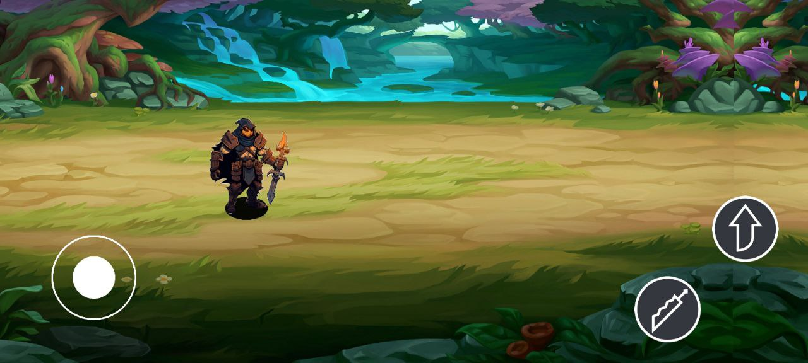
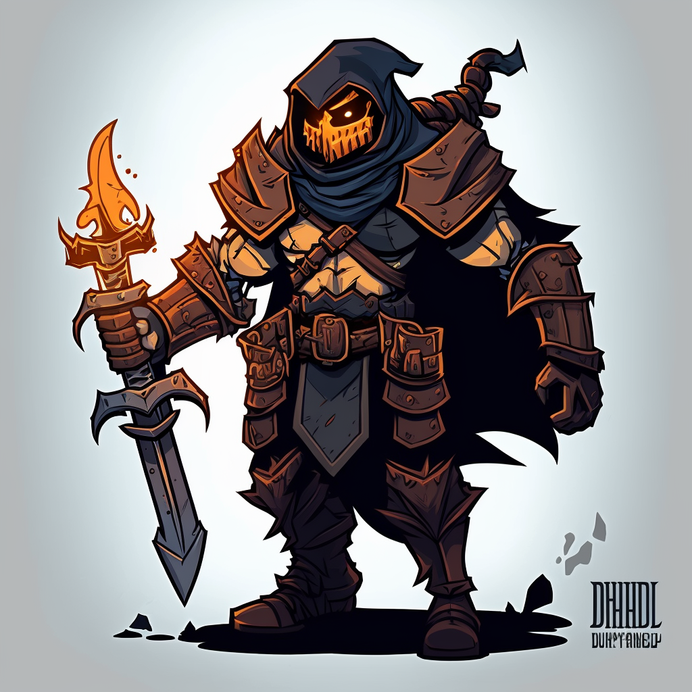

# UnityCourseProject

Here is an attempt for a game creation which consists of implementation of lections 1 to 5.
For me personally was interesting to research ways to create animation and assets using AI generated arts. 
I used MidJourney to generate pictures of main charater of game an animated it using bones and skeleton.
Heres some of original images:

For now in game implemented:
1. Paralax effect
2. UI buttons and keybord controller
3. Character annimations: idle, walking, jumping and attacking

Link for an game apk file: https://drive.google.com/file/d/1AeduB593odes44gmnS3cfTL2wW2CcEQd/view?usp=sharing
